# Blockchain in Agriculture – Enhancing Food Traceability  
### Smart Contract Deployment using **Solidity, MetaMask & Ganache**

This project implements a **Blockchain-based Food Traceability System** to ensure **transparency, immutability, and full farm-to-consumer tracking**.  
It includes two main smart contracts:

- **FoodRegistration.sol** → Product registration by farmers  
- **FoodTraceability.sol** → Tracking by distributors & retailers  

---

## **Project Overview**

Traditional food supply chains rely on centralized and vulnerable record systems.  
This project solves issues like:

- Data tampering  
- Lack of transparency  
- Difficulty in identifying contamination source  
- No unified traceability  

### Proposed Solution  
A decentralized platform that records:

- Harvest details  
- Transportation & logistics  
- Storage & quality checks   

Blockchain ensures:

- **Immutability**
- **Transparency**
- **Automation via Smart Contracts**
- **Trustless interactions between stakeholders**

---

## **Stakeholders Involved**

| Stakeholder | Responsibility |
|------------|----------------|
| **Farmer** | Registers product details |
| **Distributor** | Updates transport/movement info |
| **Retailer** | Updates storage & quality details |
| **Consumer** | Verifies product authenticity |

---

## **Smart Contracts Included**

### **1. FoodRegistration.sol**
Registers product details.

**Functions:**  
- `registerProduct()`  
- `getProduct()`
- `getAllProducts()` 

**Data Stored:**  
- Product ID  
- Product Name  
- Harvest Date  
- Farmer Name  
- Location  

---

### **2. FoodTraceability.sol**
Tracks product movement after registration.

**Functions:**  
- `updateTrace()`  
- `getTrace()`

**Data Stored:**  
- Distributor  
- Transport Date  
- Retailer  
- Quality Check Status  

---

## Deployment Guide Using MetaMask, Remix IDE & RSK Testnet

This section explains how to install MetaMask, connect the RSK Testnet, deploy your Solidity smart contracts using Remix IDE, and interact with them.

##  **Step 1: Install & Set Up MetaMask**

### 1. Install MetaMask
- Open Chrome Web Store  
- Install MetaMask extension  
  🔗 https://chrome.google.com/webstore/detail/metamask/nkbihfbeogaeaoehlefnkodbefgpgknn  
- Click **Add to Chrome** → **Add Extension**

### 2. Create or Import a Wallet
- Open MetaMask → Click **Get Started**
- Choose:
  - **Create Wallet** (new account)
  - **Import Wallet** (using Secret Phrase)
- Set a password and **save your recovery phrase securely**

---

## **Step 2: Add RSK Testnet to MetaMask**

1. Open MetaMask → Click **Network Dropdown** → **Add Network**

2. Enter the following details:

| Field | Value |
|-------|-------|
| **Network Name** | RSK Testnet |
| **RPC URL** | https://public-node.testnet.rsk.co |
| **Chain ID** | 31 |
| **Currency Symbol** | tR-BTC |
| **Block Explorer URL** | https://explorer.testnet.rsk.co |

3. Click **Save**

Your wallet is now connected to the **RSK Testnet**.

---

##  **Step 3: Fund Your Wallet (Free Test Tokens)**

1. Go to RSK Testnet Faucet:  
   🔗 https://faucet.rsk.co/
2. Paste your MetaMask wallet address

3. Request free **0.05 RBTC** (daily limit)
4. After a few seconds:
   - Tokens will appear in MetaMask

   - You can verify on the RSK Explorer:
     🔗 https://explorer.testnet.rsk.co/

---

##  **Step 4: Connect MetaMask to Remix IDE**

1. Go to Remix IDE:  
   🔗 https://remix.ethereum.org/
2. Open the **Deploy & Run Transactions** panel (left sidebar)
3. Under **Environment**, select **Injected Web3**

4. A MetaMask popup will appear:
   - Click **Next**
   - Click **Connect**

Once connected, you will see your **MetaMask account address** displayed inside Remix.

---

##  **Step 5: Deploy the Smart Contract**

### 1. Create a new file in Remix
- Create → `FoodRegistration.sol`
- Paste your smart contract code

### 2. Compile the contract
- Go to **Solidity Compiler**
- Select Version: **0.8.x**
- Click **Compile FoodRegistration.sol**

### 3. Deploy
- Go to **Deploy & Run Transactions**
- Make sure **Injected Web3** is selected
- Click **Deploy**
- MetaMask popup will appear:
  - Confirm the transaction

### 4. Verify Deployment
- After confirmation, Remix will show:
  - Contract address
  - Gas used
  - Transaction hash

You can check the transaction here:  
🔗 https://explorer.testnet.rsk.co/

---

##  **Step 6: Interact With the Smart Contract**

Once deployed, you will see the contract under **Deployed Contracts**.

You can now use:

###  **registerProduct()**
Add a new product:
- name  
- farmerName  
- harvestDate  
- location  
- Click **transact**

###  **getProduct()**
Enter a product ID → click **call**

###  **getAllProducts()**
Fetch all stored products → click **call**

Every **write** action will open a MetaMask confirmation window.

---

## Ganache Setup & Smart Contract Deployment Guide

This section explains how to install Ganache, connect it with MetaMask, link Remix IDE, deploy the smart contract, and verify all transactions — exactly as shown in the practical experiment.

## **Step 1: Install Ganache**

1. Go to the official page:  
   🔗 https://trufflesuite.com/ganache/
2. Download **Ganache GUI (Desktop Version)**.
3. Install and open Ganache.
4. Click **Quickstart** to launch a new local blockchain.

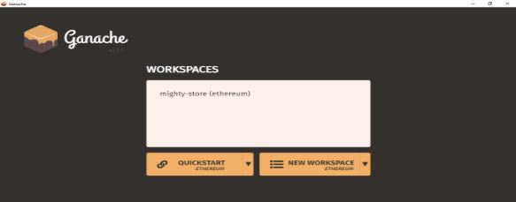

Ganache will now display:
- 10 accounts  
- RPC Server → `http://127.0.0.1:7545`  
- Genesis block information  
- Live log of all transactions  

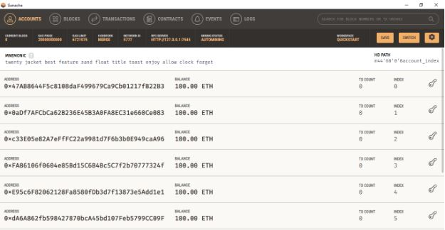

---

## **Step 2: Connect Ganache With MetaMask**

### 1. Add Ganache Network to MetaMask

Open MetaMask → Click **Network Dropdown** → **Add Network → Add a Network Manually**

Fill details:

| Field | Value |
|-------|--------|
| **Network Name** | Ganache Local |
| **New RPC URL** | http://127.0.0.1:7545 |
| **Chain ID** | 1337 |
| **Currency Symbol** | ETH |

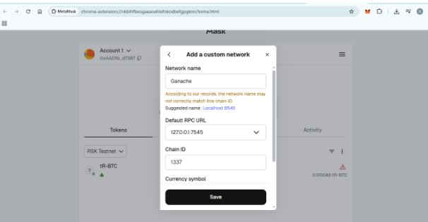
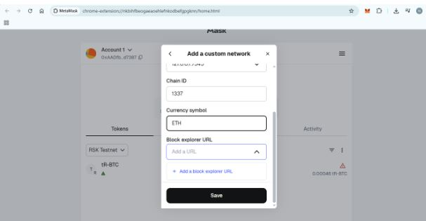

Click **Save**.

---

### 2. Import a Ganache Account into MetaMask

1. Open Ganache → Click the **key icon** to reveal a private key  
2. Copy the private key  
3. Open MetaMask → **Import Account**  
4. Paste private key → Click **Import**

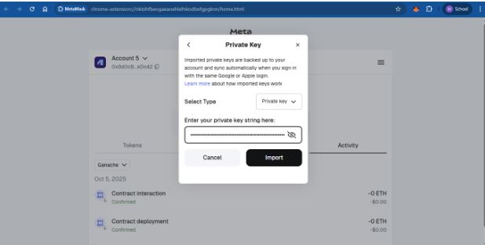

You will now see:
- 100 ETH balance (Ganache fake ETH)
- Ganache account successfully added

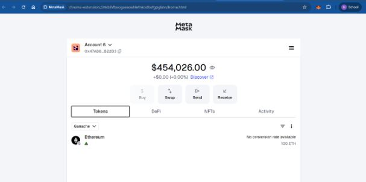

---

## **Step 3: Connect Remix IDE With MetaMask**

1. Open Remix IDE:  
   🔗 https://remix.ethereum.org/

2. Create a new Solidity file → Example: `FoodRegistration1.sol`

3. Paste your contract code.

4. Go to **Solidity Compiler**
   - Version: **0.8.x**
   - Click **Compile**

5. Open **Deploy & Run Transactions**
   - Environment → **Injected Provider (MetaMask)**
   - Account → Ganache-imported account
   - Network → Should show **GANACHE (5777) Network**

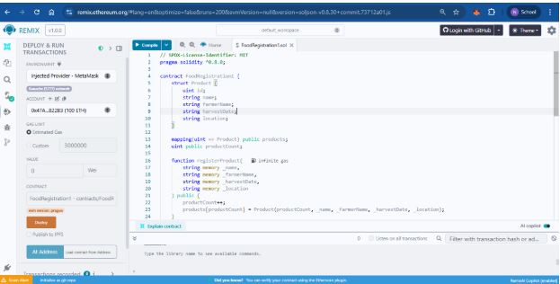

---

## **Step 4: Deploy Smart Contract via Ganache**

1. Click **Deploy** in Remix  
2. MetaMask will open → Click **Confirm**

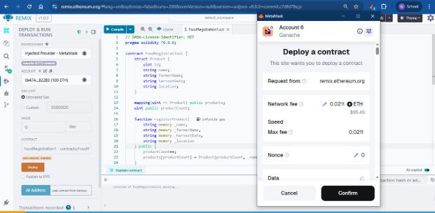

3. After deployment, Remix shows:
- Contract address  
- Gas used  
- Transaction hash  

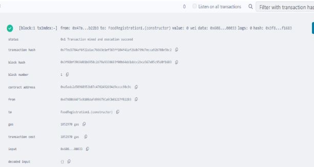

4. Ganache logs the deployment transaction automatically:

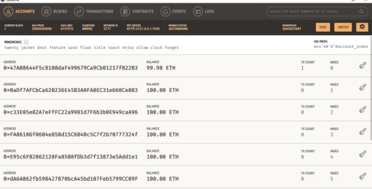

5. A new block is mined for the deployment:

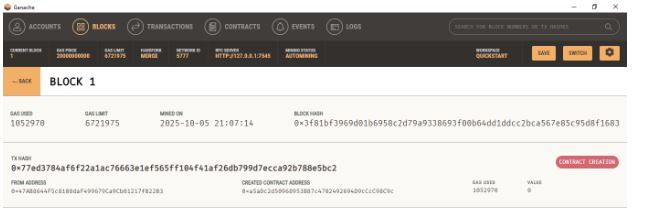

6. Perform the functions in the Smart Contract, FoodRegistration1.sol:

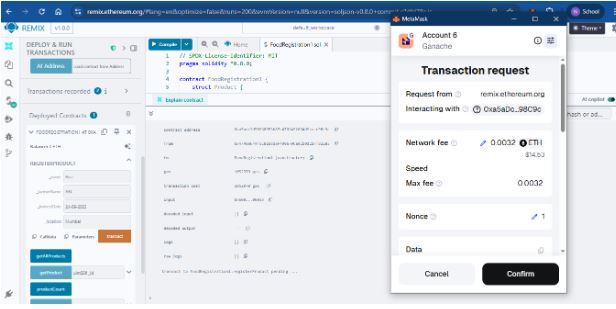
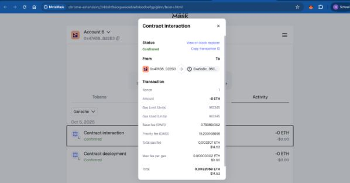

---

## **Step 5: Check Transaction Details in Ganache**

Ganache displays:
- Block number  
- Timestamp  
- Gas used  
- Smart contract address  

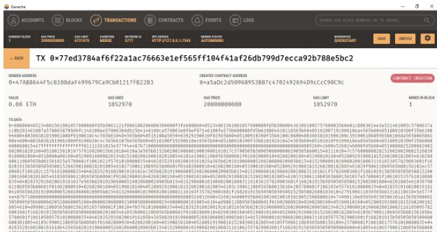

---

## **Step 6: Interact With the Smart Contract**

Use the **Deployed Contracts** section in Remix.

### Example:
- `registerProduct("Wheat", "Farmer A", "2025-05-01", "Maharashtra")`
- `getProduct(1)`
- `getAllProducts()`

Every update function creates a new transaction visible in Ganache.

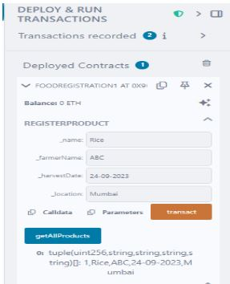
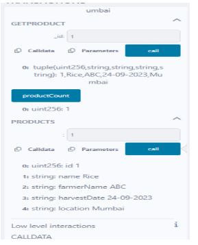

---

